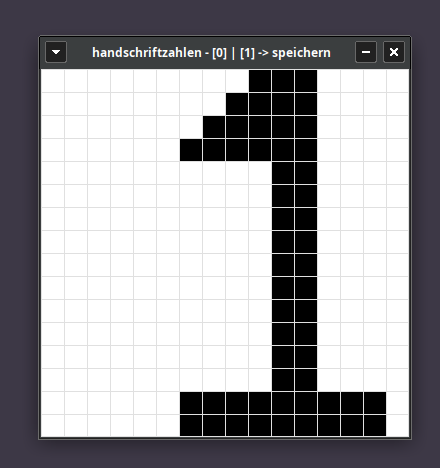

# ki-trainer-binaer
**zum erkennen handgeschriebener zahlen soll eigenes ki modell trainiert werden auf grundlage von bitoperationen?!?**
# Challenge: Bit-KI für Handschriften - Built from Scratch in Rust

## Worum geht es überhaupt?
Ich will wissen, ob es möglich ist, ein eigenes KI-Modell zur Erkennung von handschriftlichen Zahlen zu bauen, das ohne den typischen Mathe-Ballast auskommt. Normale KIs fressen Unmengen an Strom und Rechenleistung, weil sie ständig mit fetten Kommazahlen (Float32) jonglieren. Mein Ziel: Eine KI, die ausschließlich mit Low-Level-Bitoperationen (AND, OR, XOR, XNOR, NOT)??? auf der CPU arbeitet. Superschnell, superleicht und perfekt für winzige Hardware.

Da ich mir in vergangenen Projekten die Grundlagen von Rust erarbeitet habe, ziehe ich das Ganze komplett in Rust hoch. Rust ist durch seine Performance und Typsicherheit perfekt für dieses hardwarenahe Bit-Gebastel.

## Meine wichtigste Regel: Keine vorgefertigten Wege!
Ich will nicht einfach bestehende Papers (wie BNNs oder Tsetlin-Maschinen) eins zu eins kopieren oder mich von fertigen Frameworks in eine bestimmte Richtung lenken lassen. Ich möchte das Rad bewusst ein bisschen selbst neu erfinden, eigene Logik-Ansätze testen und schauen, wie weit ich mit meinen eigenen Ideen komme. 

Ich werde KI-Tools als Beschleuniger einsetzen, um Code-Strukturen zu optimieren oder Denkblockaden zu lösen - das eigentliche Architektur-Design und die Algorithmen sollen aber meinen eigenen Ideen entspringen.

## Was ich mir vorgenommen habe (Meine Meilensteine)

### 1. Der eigene Datengenerator
Ich verlasse mich nicht nur auf fertige Datensätze wie MNIST. Ich baue mir in Rust einen eigenen Datengenerator, der:
* Handgeschriebene Bitmaps (Binärbilder) von Ziffern erzeugt.
* Eigene "Bit-Verschiebe-Funktionen" nutzt (Bit-Shifting für Bewegung, Bit-Invertierung für Bildrauschen), um das Modell später richtig auf die Probe zu stellen.

### 2. Das Bit-Modell (Die eigentliche KI)
* Ich designe ein System in Rust, das Bilder einliest und die Klassifizierung rein über logische Verknüpfungen von Bits regelt.
* Ich will herausfinden, wie gut ein rein logisches Regelwerk performen kann.
* Kann ich alle Werte im u8 Bereich halten?

### 3. Der Härtetest
* Am Ende will ich schwarz auf weiß sehen: Funktioniert mein eigener Ansatz? 
* Wie schlägt sich meine Rust-Bit-KI auf meinen eigenen Daten und wie performant ist sie?

## Tech Stack und Skills
* Programmiersprache: Rust (Bit-Manipulation, hardwarenaher Code)
* Konzept: Edge-AI (Ressourceneffiziente Algorithmen ohne Ballast)
* Data Engineering: Eigene Datengenerierung und Bildbearbeitung auf Bitebene
* Arbeitsweise: KI-unterstützte Entwicklung (KI als Programmier-Copilot)

## Die Kernfrage, die ich mir selbst beantworte:
Kann man ein funktionsfähiges KI-Modell nur mit logischem Denken, ein paar Bits und feinstem Rust-Code bauen, ohne den Mainstream-Pfaden zu folgen?

## Anwendung zum Zeichnen und Speichern der Zahlen

